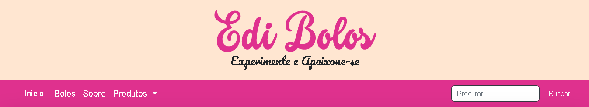
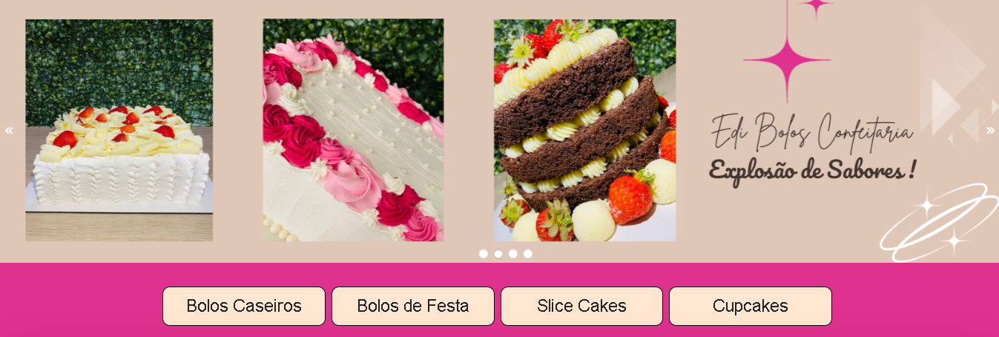
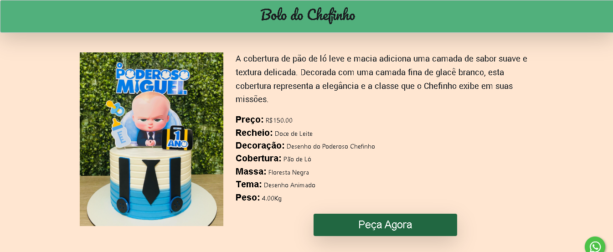

# Projeto Edibolos

 

 ## Menu do Site
  
 

 ## Carrossel de Imagens

## Lançamentos dos Produtos

## Footer do Site

## Página para fazer o pedido do produto

# Informações Sobre o Projeto

## Sobre

O Projeto Edibolos é um projeto REAL desenvolvido para a loja de bolos @edibolosconfeitaria.

## Tecnologias Utilizadas

Tecnologias que foram utilizadas no projeto:

- [HTML](https://html.com/)
- [CSS](https://www.css.com/)
- [JavaScript](https://www.javascript.com/)
- [PHP](https://www.php.net/)
- [MySqli](https://www.php.net/manual/pt_BR/book.mysqli.php)
---
Desenvolvido por Guilherme Vasconcellos 👨‍💻
